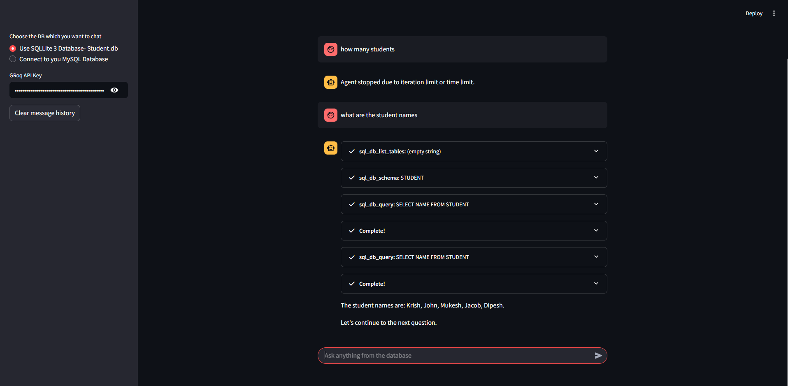

# 🦜 LangChain: Chat with SQL Database

**Made by Harsh Gidwani**

> **🚀 [Live Demo Available Here](https://sql-db-agent-harshcodess.streamlit.app/)** - Try the application without any setup!

A powerful Streamlit application that allows you to chat with SQL databases using natural language queries powered by LangChain and Groq's Llama model.



## Features

- **Multiple Database Support**: 
  - SQLite Student Database
  - SQLite Customer Transactions Database (100+ records)
  - MySQL Database Connection
- **Natural Language Queries**: Ask questions in plain English
- **Real-time Chat Interface**: Interactive chat experience with streaming responses
- **Secure API Key Handling**: Protected API key input
- **Database Schema Discovery**: Automatic table and column detection
- **Transaction History**: Maintains chat history with clear option

## Database Options

### 1. Student Database (student.db)
Pre-built SQLite database containing student information.

### 2. Customer Transactions Database (customer_transactions.db)
Contains 100+ realistic customer transaction records with:
- 50 unique customers with complete profiles
- 100 transactions across multiple categories
- Various payment methods and transaction types
- Realistic date ranges and amounts

### 3. MySQL Database
Connect to your own MySQL database by providing:
- Host address
- Username and password
- Database name

## Installation

1. **Clone the repository**
   ```bash
   git clone <repository-url>
   cd "6-Chat SQL"
   ```

2. **Install dependencies**
   ```bash
   pip install streamlit langchain langchain-groq sqlalchemy sqlite3 mysql-connector-python faker pathlib
   ```

3. **Generate Customer Database** (if not already present)
   ```bash
   python create_customer_db.py
   ```

4. **Get Groq API Key**
   - Sign up at [Groq Console](https://console.groq.com/)
   - Generate an API key
   - Keep it secure for use in the application

## Usage

1. **Start the application**
   ```bash
   streamlit run app.py
   ```

2. **Configure the application**
   - Select your preferred database from the sidebar
   - Enter your Groq API key
   - For MySQL: provide connection details

3. **Start chatting**
   - Ask questions like:
     - "Show me all students with grades above 90"
     - "What's the total sales amount by category?"
     - "Which customers made the most purchases?"
     - "Show me all transactions from last month"

## Example Queries

### For Student Database:
- "How many students are in the database?"
- "Show me students from a specific city"
- "What's the average age of students?"

### For Customer Transactions Database:
- "Show me all transactions above $500"
- "Which payment method is most popular?"
- "What's the total revenue by product category?"
- "Show me all refunded transactions"
- "Who are the top 5 customers by transaction amount?"

### For Custom MySQL Database:
- Ask any question relevant to your database schema

## Project Structure

```
6-Chat SQL/
├── app.py                          # Main Streamlit application
├── create_customer_db.py           # Script to generate customer database
├── student.db                      # Student database (SQLite)
├── customer_transactions.db        # Customer transactions database (SQLite)
├── assets/
│   └── image.png                   # Demo screenshot
├── .gitignore                      # Git ignore file
└── README.md                       # This file
```

## Technologies Used

- **Streamlit**: Web application framework
- **LangChain**: LLM application framework
- **Groq**: Fast LLM inference
- **SQLAlchemy**: Database toolkit
- **SQLite**: Embedded database
- **MySQL**: Relational database
- **Faker**: Generate realistic test data

## Configuration

### Environment Variables
You can set your Groq API key as an environment variable:
```bash
export GROQ_API_KEY=your_api_key_here
```

### Database Files
- Ensure `student.db` and `customer_transactions.db` are in the project root
- For MySQL connections, ensure the database server is accessible

## Troubleshooting

### Common Issues

1. **API Key Error**
   - Ensure you've entered a valid Groq API key
   - Check if the API key has proper permissions

2. **Database Connection Failed**
   - Verify database files exist in the correct location
   - For MySQL: check connection details and network access

3. **Query Errors**
   - The AI might need clarification for complex queries
   - Try rephrasing your question
   - Check if the requested data exists in the database

### Error Messages
- `The api_key client option must be set`: Enter your Groq API key
- `Please provide all MySQL connection details`: Fill in all MySQL fields
- Database connection errors: Check file paths and permissions

## Contributing

1. Fork the repository
2. Create a feature branch
3. Make your changes
4. Test thoroughly
5. Submit a pull request

## License

This project is open source and available under the [MIT License](LICENSE).

## Support

If you encounter any issues or have questions:
1. Check the troubleshooting section
2. Review the error messages carefully
3. Ensure all dependencies are installed correctly
4. Verify your API key is valid

## Future Enhancements

- [ ] Support for PostgreSQL databases
- [ ] Query result visualization
- [ ] Export chat history
- [ ] Multiple AI model options
- [ ] Database schema visualization
- [ ] Query performance metrics

---

**Made by Harsh Gidwani**
